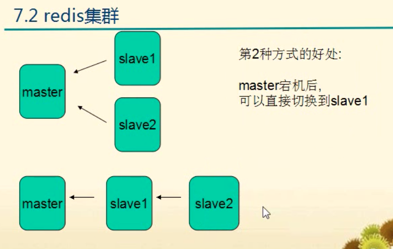

# redis主从复制

## 集群的作用
1. 主从备份，防止主机宕机。（master宕机后，可以直接切换到slave1）
2. 读写分离，分担master的任务
3. 任务分离，如从服务器分担备份工作和计算工作

## redis集群配置

### Master配置
1. 关闭rdb快照（备份工作交给slave）
2. 可以开启aof

### slave配置
1. 声明slave-of `slave-of localhost 6379`
2. 配置密码【如果master有密码】`masterauth your_master_password`
3. 某一个slave打开rdb快照功能
4. 配置是否只读【slave-read-only】

## redis主从复制的缺陷

缺陷：  
每次slave断开后，无论是主动断开，还是网络故障， 再连接master，都要master全部dump出来rdb，再aof，即同步的过程都要重新执行1遍。

所以要记住，多台slave不要一下都启动起来，否则master可能IO剧增